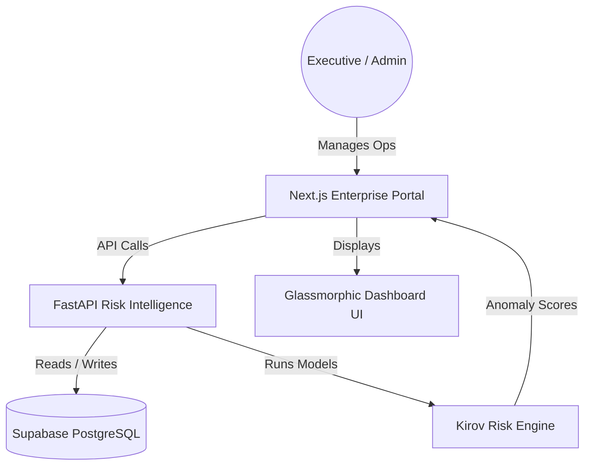

# 🏛️ Opsly SaaS — Enterprise Operations OS

> **Future Project · Seeking Contributors & Funding**


[](https://github.com/Raphasha27/opsly-saas/actions)
[](https://github.com/Raphasha27/opsly-saas/actions)
[](https://github.com/Raphasha27/opsly-saas)
[](./LICENSE)

---

## 🚀 Vision

**Opsly SaaS** is a next-generation enterprise operations platform designed to give teams total visibility over projects, resources, and risks — all in a single, AI-powered dashboard.

This project is **actively developed** and **open to contributors, collaborators, and early-stage investors** who see the potential in intelligent business infrastructure for African and global SMEs.

---

## 🧠 What It Does

| Feature | Description |
| :--- | :--- |
| **Kirov Risk Engine** | AI-powered anomaly detection that flags project health risks in real time |
| **Operations Dashboard** | Executive-grade glassmorphic UI for monitoring teams and milestones |
| **Task Intelligence** | Automated workload distribution and bottleneck forecasting |
| **Audit Trails** | Immutable activity logs with integrity verification |
| **Role-Based Access** | Fine-grained permissions for enterprise security |

---

## 🛠️ Tech Stack

| Layer | Technology |
| :--- | :--- |
| **Frontend** | Next.js 14, TypeScript, Tailwind CSS |
| **AI/ML Backend** | FastAPI (Python), Scikit-Learn, Pandas |
| **Database** | Supabase (PostgreSQL) |
| **Auth** | Supabase Auth / NextAuth.js |
| **CI/CD** | GitHub Actions |
| **Planned Deployment** | Vercel (frontend) + Render (FastAPI backend) |

> ⚠️ **Deployment Note:** This project is not yet deployed to avoid billing risk during development. When ready, the frontend will be hosted on **Vercel** and the intelligence API on **Render** (free tier).

---

## 🏗️ Architecture



---

## 🧪 How to Run Locally

```bash
# 1. Clone the repository
git clone https://github.com/Raphasha27/opsly-saas.git
cd opsly-saas

# 2. Install frontend dependencies
npm install

# 3. Copy environment variables
cp .env.example .env.local
# Fill in your Supabase URL and Anon Key

# 4. Start the Next.js development server
npm run dev
# Open http://localhost:3000

# 5. (Optional) Start the FastAPI intelligence backend
cd api
pip install -r requirements.txt
uvicorn main:app --reload --port 8000
```

---

## 🤝 Contributing

This project welcomes contributors across all skill levels:

- 🎨 **Frontend Developers** — Improve the dashboard UI/UX
- 🤖 **ML Engineers** — Enhance the Risk Engine models
- 🔐 **Security Specialists** — Harden authentication and audit systems
- 📝 **Technical Writers** — Improve documentation

**To contribute:** Fork the repo → Create a branch → Submit a PR.

---

## 💡 Funding & Collaboration

> This project is part of the **Kirov Dynamics Technology** ecosystem — an African-owned engineering initiative building sovereign digital infrastructure for the continent.
>
> If you see potential here, reach out via the [Kirov Dynamics Portfolio](https://portfolio-react-zeta-black-48.vercel.app/).

---


