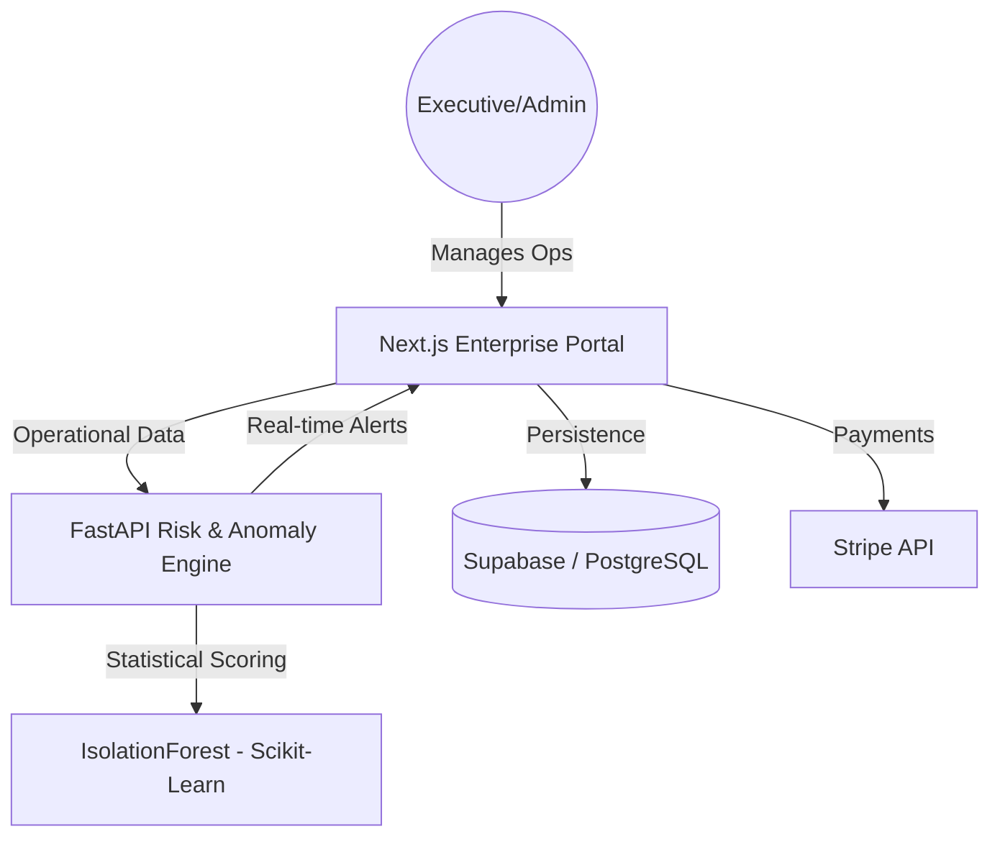

# 🏛️ Opsly SaaS: Enterprise Operations OS

*Run your team, projects, and operations in one unified, high-integrity dashboard.*

---

## 🏛️ Architecture Overview
Opsly is architected for scalability and reliability, bridging a high-performance Next.js frontend with a resilient FastAPI intelligence layer.

## 🚀 Key Capabilities
| Capability | Sentinel Feature | Tech Stack |
| :--- | :--- | :--- |
| **Risk Scoring** | Real-time anomaly detection & threat scoring. | Python / Scikit-Learn |
| **Org Management** | Multi-tenant governance for scaling teams. | Next.js / Supabase |
| **Audit Logs** | High-fidelity logging of all system actions. | Kirov Audit Logic |
| **Mock Fallback** | Resilient UI that works without DB connection. | Client-side State |

## 🛠️ Intelligence Suite: Kirov Risk Engine
Opsly features a built-in **Risk & Anomaly Engine** that monitors operational metrics to detect suspicious activity:
- **Anomaly Detection**: Uses `IsolationForest` to identify outliers in login frequency and data transfer.
- **Predictive Scoring**: Heuristic-ML hybrid that calculates real-time risk percentages for every user action.

## 🚦 Deployment
Opsly is production-ready and optimized for zero-cost deployment via the Kirov Sovereign Stack:
- **Frontend**: Vercel (Free Tier)
- **Database/Auth**: Supabase (Free Tier)
- **AI Services**: Render / Railway (Free Tier)

---
© 2026 Kirov Dynamics Technology · Built for Professional Scale.
